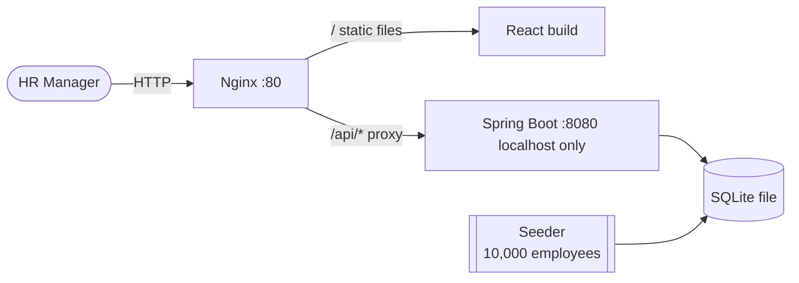
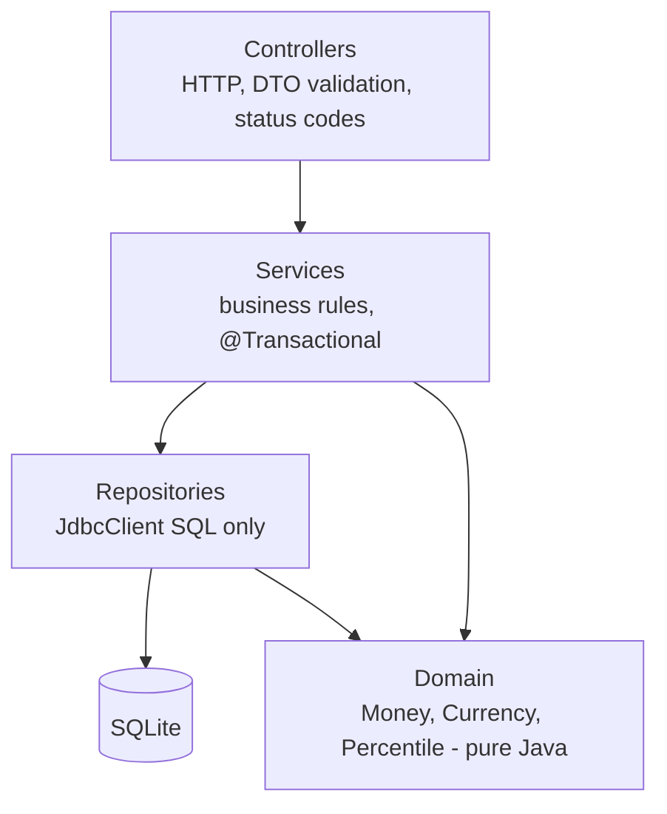
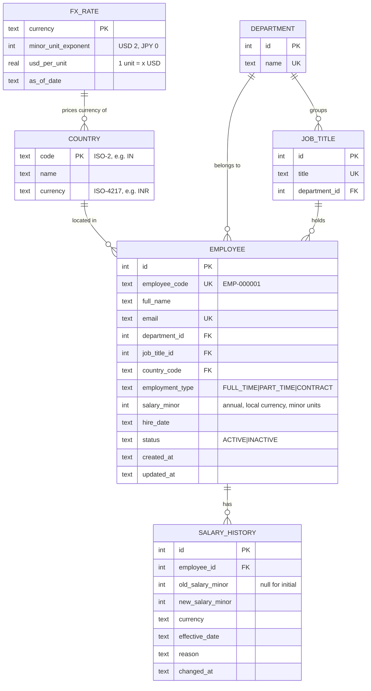
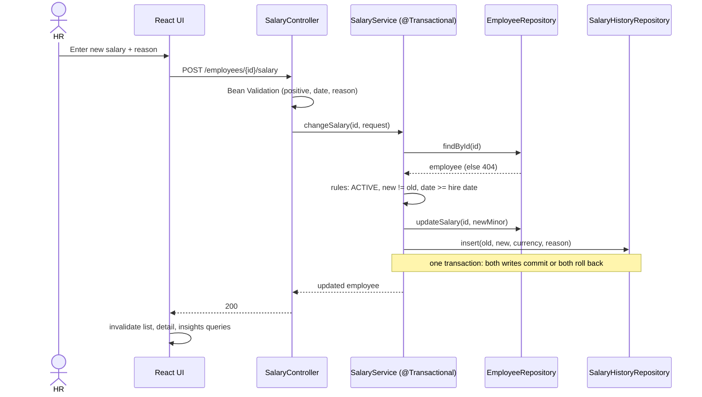
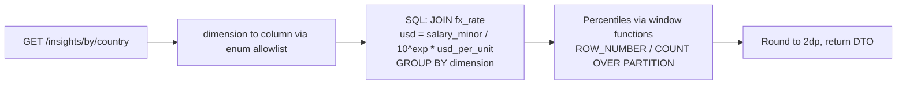
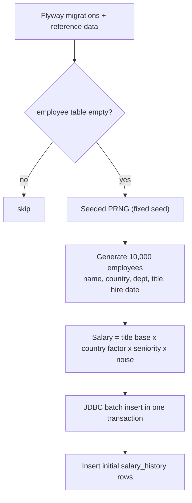
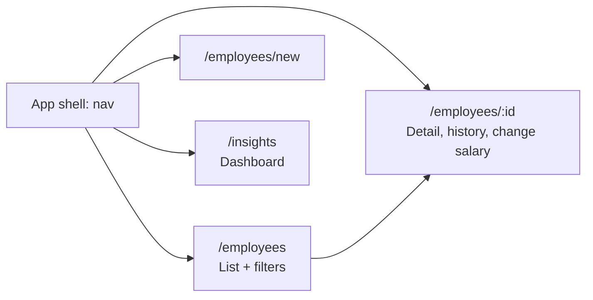
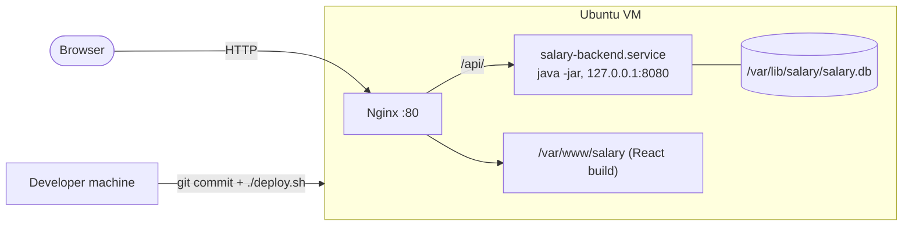

# Design Document

Diagrams use Mermaid (renders on GitHub and in VS Code).

## 1. Tech stack

| Layer | Choice | Reason |
|-------|--------|--------|
| Backend | **Java 17, Spring Boot 3.x**, Maven | Given by the brief/role |
| Web | Spring Web MVC + Jakarta Bean Validation | Standard, declarative validation |
| Data access | **Spring `JdbcClient`** (plain SQL) + `sqlite-jdbc` | Aggregates/window functions are the heart of the insights feature. Explicit SQL is easier to reason about and tune than JPA on SQLite |
| Migrations | **Flyway** (`V1__init.sql`, ...) | Versioned, repeatable schema |
| DB | **SQLite** (WAL mode) | Required by the brief, zero-ops |
| API docs | springdoc-openapi (Swagger UI at `/swagger-ui.html`) | Free, self-documenting API |
| Backend tests | JUnit 5, AssertJ, Mockito, Spring `MockMvc`, JaCoCo | Fast, deterministic |
| Frontend | **React 18 + TypeScript + Vite** | Required by the brief |
| UI kit | **MUI** | Accessible, mature components |
| Data fetching | TanStack Query, React Router | Caching, pagination state, URL routes |
| Charts | Recharts | Bar and histogram charts |
| Frontend tests | Vitest + React Testing Library | Fast component tests |
| Hosting | Single Ubuntu 20.04 VM: **Nginx** (static UI + reverse proxy) + Spring Boot **systemd** service | One public URL, no CORS issues |

## 2. Repositories
| Repo | Contents |
|------|----------|
| `salary-backend` | Spring Boot app, Flyway migrations, seed, tests, **`docs/`** (requirements, design, tasks, test-strategy, performance), `deploy.sh` |
| `salary-frontend` | React app, tests, `deploy.sh` |

Docs live in the backend repo. The frontend README links to them.

## 3. System context



## 4. Backend architecture

Layers: dependencies point downward only. Controllers hold no business rules, and SQL lives only in repositories.



Package layout (`com.acme.salary`):

```
salary-backend/
  pom.xml  mvnw  deploy.sh
  src/main/java/com/acme/salary/
    SalaryApplication.java
    config/         # DataSource pragmas (WAL, FK), Clock bean, OpenAPI
    common/         # ApiError, exceptions, GlobalExceptionHandler, PageResponse
    domain/         # Money, CurrencyInfo, Percentiles   (pure, no Spring)
    employee/       # EmployeeController, EmployeeService, EmployeeRepository, dto/
    salary/         # SalaryController, SalaryService, SalaryHistoryRepository
    insights/       # InsightsController, InsightsService, InsightsRepository
    meta/           # MetaController (filter options), health
    seed/           # SeedRunner, EmployeeGenerator, ReferenceData, SplittableRandom-based PRNG
  src/main/resources/
    application.yml
    db/migration/V1__init.sql  V2__reference_data.sql
  src/test/java/...   # unit/  integration/
  docs/
```

**Clock injection:** services take a `java.time.Clock` bean, so tests use `Clock.fixed(...)`.

## 5. Data model



### Indexes (driven by queries)
| Index | Serves |
|-------|--------|
| `employee(country_code, department_id, job_title_id)` | filters and group-by |
| `employee(status)` | active-only views |
| `employee(full_name COLLATE NOCASE)` | name prefix search and sort |
| `employee(salary_minor)` | sort by salary |
| `salary_history(employee_id, changed_at DESC)` | history panel |
| unique `employee_code`, `email` | lookup and uniqueness |

**Money rule:** `salary_minor` is an integer (12,345.67 becomes `1234567`). Java uses `long` and `BigDecimal` only, never `double`. USD conversion happens at query time via `fx_rate`, so rates can change without rewriting employee rows.

## 6. API contract (REST/JSON, base `/api/v1`)

Errors: `{ "error": { "code", "message", "details?" } }` (Spring `@RestControllerAdvice`).

| Method | Path | Purpose |
|--------|------|---------|
| GET | `/employees?page&size&sort&order&q&country&department&jobTitle&status` | Paginated list, returns `{ items, page, size, total }` |
| GET | `/employees/{id}` | Detail |
| POST | `/employees` | Create (writes initial history row) |
| PATCH | `/employees/{id}` | Update non-salary fields |
| POST | `/employees/{id}/salary` | Change salary `{ newSalary, effectiveDate, reason }` |
| GET | `/employees/{id}/salary-history` | History |
| POST | `/employees/{id}/deactivate` | Soft delete |
| GET | `/employees/export.csv?...filters` | Streamed CSV |
| GET | `/insights/summary?country&department` | Headcount, avg/median/min/max (USD) |
| GET | `/insights/by/{dimension}` | `country`, `department` or `jobTitle`; stats per group |
| GET | `/insights/distribution?buckets` | Salary histogram (USD) |
| GET | `/insights/top?direction=highest\|lowest&limit` | Top/bottom earners |
| GET | `/meta/filters` | Countries, departments, job titles |
| GET | `/actuator/health` | Liveness |

## 7. Key flows

### 7.1 Change a salary (transactional)



### 7.2 Insights query path



**Median / p90:** SQLite has no percentile function. Rank rows per group using `ROW_NUMBER() OVER (PARTITION BY g ORDER BY usd)` and `COUNT(*) OVER (PARTITION BY g)`, then take the row at `ceil(p*n)` (nearest-rank). A pure `Percentiles` class is unit-tested and used in an integration test to cross-check the SQL.

**Dimension safety:** `{dimension}` is parsed into a Java `enum` mapped to a fixed column name. User input is never concatenated into SQL. All values are bound parameters.

### 7.3 Seeding



Seeding runs from an `ApplicationRunner` when `app.seed.enabled=true` and the table is empty, so the VM boots to a populated DB. It can also be run explicitly with `--app.seed.force=true`. The fixed seed makes data identical on every run.

## 8. Frontend design



**Employees list**
```
+--------------------------------------------------------------+
| ACME Salary Mgmt    [Employees] [Insights]                   |
+--------------------------------------------------------------+
| [Search name/email/code____] [Country v][Dept v][Title v]    |
| [Status v]                          [Export CSV] [+ Add]     |
+--------------------------------------------------------------+
| Code       Name        Title     Country  Salary     Status  |
| EMP-000001 A. Sharma   Engineer  IN       ₹18,50,000 Active  |
+--------------------------------------------------------------+
| Rows: 25 v          1-25 of 10,000        < 1 2 3 ... >      |
+--------------------------------------------------------------+
```

**Insights dashboard**
```
+--------------------------------------------------------------+
| KPI: Headcount | Avg (USD) | Median (USD) | Min | Max        |
+--------------------------------------------------------------+
| [Group by: Country | Department | Job title]                 |
| Bar chart: median salary per group   | Table: n/min/avg/     |
|                                      |  median/p90/max       |
+--------------------------------------------------------------+
| Salary distribution histogram (USD)   | Top 10 / Bottom 10   |
+--------------------------------------------------------------+
```

UI rules: filters and page live in the **URL query string** (shareable, survives refresh). Search is **debounced** (300 ms). TanStack Query with previous-data retention prevents table flicker. Loading skeletons, empty states, error banners with retry. Labelled inputs and keyboard-navigable table.

## 9. Validation rules
| Field | Rule |
|-------|------|
| fullName | 1–120 chars, trimmed |
| email | valid, unique (409 on conflict) |
| salary | > 0, sane maximum, valid for the currency's minor units |
| country | must exist |
| hireDate | valid, not in the future (via injected `Clock`) |
| effectiveDate | valid, not before hire date |
| salary change | employee ACTIVE, new value differs from current |

Mapping: `MethodArgumentNotValidException` and `ValidationException` return 400, `NotFoundException` 404, `ConflictException` 409, anything else 500 (details hidden, logged).

## 10. Performance design
See [performance.md](performance.md). Summary: server-side pagination, indexes, SQL aggregation, WAL, batch seed, streamed CSV.

## 11. Deployment and CI/CD (Ubuntu VM)



- **VM facts:** Ubuntu 20.04, about 1 GB RAM, no swap, ports 22/80/443/8080 open. Setup adds Java 17 (headless JRE), Nginx, and a 1 GB swapfile as headroom. The JVM runs with `-Xmx384m`.
- **Backend `deploy.sh`:** run tests, `./mvnw package`, `scp` the jar to `/opt/salary/`, `sudo systemctl restart salary-backend`, then poll `/actuator/health` and fail loudly if it does not come up.
- **Frontend `deploy.sh`:** `npm test`, `npm run build`, `scp`/`rsync` `dist/` to `/var/www/salary/`. Nginx serves it with SPA fallback to `index.html`.
- **Rule:** every code change is committed and then deployed with `deploy.sh`. The build happens on the developer machine (the VM has too little RAM for Maven or Vite builds).
- The SSH private key stays outside both repositories (`~/.ssh`) and is never committed.
- The app is served by Nginx on port 80 of the VM (address given in the submission email). HTTPS is not set up (no domain), so the demo uses fictional data only.

## 12. Key decisions and trade-offs

| Decision | Chosen | Alternative | Reason / consequence |
|----------|--------|-------------|----------------------|
| Data access | `JdbcClient` + SQL | Spring Data JPA/Hibernate | SQLite's Hibernate dialect is community-maintained, and insights need window functions and group-by. JPA would end up as native queries anyway. Cost: hand-written mappers |
| Money | integer minor units + currency | floats / BigDecimal columns | Exact arithmetic, currency exponent handled in `Money` |
| Cross-country comparison | Convert to USD at query time from a static rate table | Store USD per row, or live FX API | No stale data, deterministic tests, no external dependency. Caveat: market FX ignores purchasing power, and the UI shows the rate date |
| History | Append-only `salary_history` in the same transaction | Generic audit log / event sourcing | Simple and answers "what changed and why". Does not track who (no auth yet, `changed_by` reserved) |
| Delete | Soft delete (`INACTIVE`) | Hard delete | Salary data is historically relevant. Inactive rows are excluded from insights by default |
| Pagination | Server-side, OFFSET | Client-side, keyset | UI stays fast. OFFSET is fine at 10k. Keyset is future work |
| Search | Prefix match on indexed name, exact on code/email | Substring `%x%` / FTS5 | Index-friendly. FTS5 is the follow-up |
| Auth | None in MVP | Spring Security | One persona, not requested. First hardening step before real data |
| Deployment | Nginx + systemd on the given VM, build locally | Docker, build on VM | Matches the VM given, and low RAM rules out building there |
| Percentiles | SQL window functions, cross-checked by Java helper | Load rows and compute in Java | Speed and flat memory, plus a correctness check |
| SQLite limits | Single writer, no native percentile | PostgreSQL | Fine for one HR user. Repositories isolate SQL, so a Postgres move is contained |
| Scope | Depth on list, edit, insights | Breadth (auth, import, bands) | Judgment over complexity |
