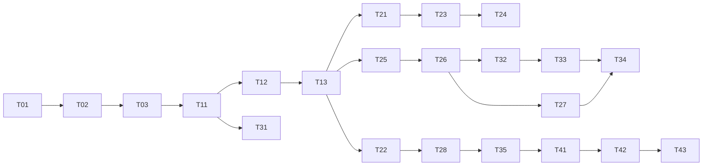

# Task Plan and Commit Roadmap

The brief asks for **incremental commits** that show how the solution evolved. Each task is one small, working, tested commit (Conventional Commits), followed by a deploy to the VM. Backend and frontend live in separate repositories (`salary-backend`, `salary-frontend`).

```mermaid
gantt
    title Delivery plan (indicative)
    dateFormat  X
    axisFormat  %s
    section Setup
    Docs + repos + VM provisioning :done, a1, 0, 1
    Backend scaffold + first deploy :a2, after a1, 1
    Schema + migrations             :a3, after a2, 1
    section Backend
    Domain (Money, Percentiles)     :b1, after a3, 1
    Seed 10k                        :b2, after b1, 1
    Employee CRUD + list            :b3, after b2, 2
    Salary change + history         :b4, after b3, 1
    Insights                        :b5, after b4, 2
    section Frontend
    Scaffold + first deploy         :c0, after a2, 1
    List + detail                   :c1, after b3, 2
    Forms + salary dialog           :c2, after c1, 1
    Insights dashboard              :c3, after b5, 2
    section Ship
    Polish + perf numbers           :d1, after c3, 1
    README + demo video             :d2, after d1, 1
```

## Definition of Done (each task)
1. Tests written and passing (backend `./mvnw test`, frontend `npm test`).
2. Build is clean (no compiler warnings, lint clean).
3. Docs updated if behaviour or design changed.
4. One focused commit with a clear message, pushed.
5. **Deployed to the VM** with `deploy.sh` and smoke-checked through Nginx.

## Task list

### Phase 0: Thinking artifacts and infrastructure
| ID | Task | Repo | Commit |
|----|------|------|--------|
| T0.1 | Requirements, design, tasks, test strategy, performance docs | backend | `docs: add requirements, design, tasks, test strategy, performance` |
| T0.2 | Init both git repos; `.gitignore` (keys, DB files, build output) | both | `chore: init repository` |
| T0.3 | Provision VM: Java 17 JRE, Nginx, swap, `/opt/salary`, `/var/lib/salary`, systemd unit, Nginx site (static + `/api` proxy) | backend (`deploy/` folder holds the unit and nginx conf) | `build: vm provisioning scripts` |

### Phase 1: Backend foundation
| ID | Task | Acceptance criteria | Commit |
|----|------|--------------------|--------|
| T1.1 | Spring Boot scaffold (Web, Validation, Actuator, JDBC, Flyway, sqlite-jdbc, springdoc), `deploy.sh`, health endpoint | App boots. **First deploy**: `/actuator/health` returns UP on the VM | `chore: scaffold spring boot app and deploy script` |
| T1.2 | SQLite DataSource config (WAL, foreign keys ON) | Test verifies pragmas | `feat(db): sqlite configuration` |
| T1.3 | `V1__init.sql` (tables, indexes) and `V2__reference_data.sql` (countries, FX rates, departments, titles) | Schema test asserts tables, FKs, unique constraints | `feat(db): schema and reference data` |

### Phase 2: Backend core
| ID | Task | Acceptance criteria | Commit |
|----|------|--------------------|--------|
| T2.1 | `Money` and currency exponent handling | JPY 0dp, USD 2dp, half-up rounding, no float drift, rejects negatives | `feat(domain): money` |
| T2.2 | `Percentiles` (nearest-rank, median) | empty / single / even / odd / duplicates / p90 | `feat(domain): percentiles` |
| T2.3 | Seed generators and ReferenceData (fixed-seed PRNG) | Same seed gives identical output, salaries in band, unique email/code | `feat(seed): deterministic generators` |
| T2.4 | `SeedRunner` (10,000, one transaction, seed-if-empty) | Completes in under 5 s, count = 10,000, history rows exist | `feat(seed): seed 10,000 employees` |
| T2.5 | Employee list: filters, search, sort, pagination | Each filter, combined filters, page edges, size cap 100, injection-style input in `q`/`sort` | `feat(employees): paginated list` |
| T2.6 | Create / get / patch / deactivate, validation, `GlobalExceptionHandler` | 400 / 404 / 409 paths | `feat(employees): CRUD with validation` |
| T2.7 | Salary change + history endpoint | Atomic (forced failure rolls back), inactive rejected, no-op rejected, date before hire rejected | `feat(salary): change with history` |
| T2.8 | Insights: summary, by-dimension, distribution, top/bottom | SQL results equal hand-computed fixture and `Percentiles`. Bad dimension gives 400 | `feat(insights): pay analytics` |
| T2.9 | CSV export (streamed, escaped) | Commas, quotes, newlines escaped, filters respected | `feat(export): csv export` |
| T2.10 | `/meta/filters`, request logging | Integration tests | `feat(api): meta endpoint` |

### Phase 3: Frontend (repo `salary-frontend`)
| ID | Task | Acceptance criteria | Commit |
|----|------|--------------------|--------|
| T3.1 | Vite + React + TS + MUI scaffold, routing, API client, Query provider, `deploy.sh`, first deploy | Shell served by Nginx at the VM, `/api` reachable | `chore: scaffold frontend and deploy script` |
| T3.2 | Employee table: pagination, sort, URL-synced filters, debounced search | Component tests for filter-to-request mapping | `feat(ui): employee list` |
| T3.3 | Employee detail with salary history | Loading, empty, error states | `feat(ui): employee detail` |
| T3.4 | Create/edit form and salary-change dialog | API field errors shown, queries invalidated | `feat(ui): employee forms` |
| T3.5 | Insights dashboard (KPIs, group-by chart and table, histogram, top/bottom) | Renders from mocked API, group switch works | `feat(ui): insights dashboard` |
| T3.6 | CSV export button, accessibility pass, responsive polish | Keyboard navigation works | `feat(ui): export and polish` |

### Phase 4: Quality and delivery
| ID | Task | Acceptance criteria | Commit |
|----|------|--------------------|--------|
| T4.1 | Performance verification: `EXPLAIN QUERY PLAN` checks, benchmark vs budgets, numbers in `performance.md` | List < 300 ms, insights < 500 ms | `perf: verify indexes and record benchmarks` |
| T4.2 | READMEs (run, test, deploy, architecture) and demo video link | A new reader runs it in under 5 minutes | `docs: readme and demo link` |
| T4.3 | Final email with both repo links, live URL and video | Sent by the user as a reply to the original email | n/a |

## Dependency graph

## Ordering rationale
- **Deploy pipeline first (T1.1 / T3.1):** each later commit is deployed the same day, so deployment problems show up early.
- Seeding lands (T2.4) before list and insights, so all later features are developed against realistic 10k data.
- Insights (T2.8) is the main differentiator and comes right after the CRUD slice.
