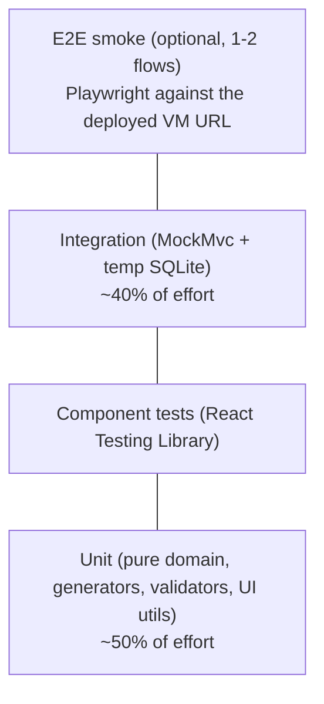

# Test Strategy

Goals from the brief: **meaningful, fast, deterministic, easy to understand.**

## 1. Principles
- **Deterministic:** no real clock, network, or unseeded randomness. Time comes from an injected `java.time.Clock` (`Clock.fixed`). The PRNG is seeded. Each integration test class uses a fresh temp-file SQLite DB (JUnit `@TempDir`) migrated by Flyway.
- **Fast:** the whole suite should run in about 10 s. Seeded fixtures are small (10–50 rows) except one explicit scale test.
- **Readable:** Arrange-Act-Assert, one behaviour per test, names describe behaviour ("rejects salary change for inactive employee").
- **Test behaviour, not implementation:** integration tests go through Spring `MockMvc` and assert HTTP responses, not repository internals.

## 2. Test pyramid

## 3. What is tested where

| Area | Type | Key cases |
|------|------|-----------|
| `Money` | Unit | 12345.67 to 1234567; JPY 0dp; rounding half-up; no float error (0.1+0.2); reject NaN/negative |
| `Percentiles` | Unit | empty, single value, even/odd count, duplicates, p90 nearest-rank |
| Seed generators | Unit | same seed gives same output; salaries within country/title band; unique emails and codes; valid hire dates |
| Request DTO validation (Bean Validation) | Unit | boundaries: empty name, 121-char name, bad email, future hire date, zero/negative salary |
| Employee list | Integration | pagination edges (page 0, last page, beyond last), page size cap, each filter, combined filters, search by name/email/code, sort asc/desc, SQL-injection-ish input in `q` and `sort` |
| Employee create/patch | Integration | 201 with history row; 400 field errors; 409 duplicate email; 404 unknown |
| Salary change | Integration | updates salary and adds history in one transaction; **rollback** when history insert fails (injected fault); rejects inactive, same value, effective date before hire |
| Insights | Integration | on a hand-computed fixture: group stats equal expected USD numbers; median equals `Percentiles` result; unknown dimension gives 400; empty groups omitted |
| CSV export | Unit + Integration | escaping of commas, quotes, newlines; filters respected; header row |
| Scale/perf | Integration (JUnit `@Tag("perf")`, excluded from default run) | seed 10k, list under 300 ms, insights under 500 ms |
| UI list | Component | filter change updates URL and query params; debounce; empty/error states |
| UI salary dialog | Component | validation messages; success invalidates queries |
| UI insights | Component | renders KPIs and switch of group-by from mocked API |

## 4. Fixtures
- `SqliteTestSupport`: creates a temp SQLite file, runs Flyway, returns a `DataSource`.
- `EmployeeFixtures`: `anEmployee().withCountry("IN").withSalary(...)` builder with sensible defaults and an incrementing counter (no randomness).
- A small **insights fixture** with hand-calculable numbers (e.g. 5 USD employees: 50k, 60k, 70k, 80k, 90k, so median = 70k). The expected numbers are written in the test, never computed by the code under test.

## 5. Coverage targets
- Domain and services: **≥ 90%** line and branch (JaCoCo).
- Overall backend: **≥ 80%**.
- Coverage is a guard, not the goal. Every bug fixed gets a regression test.

## 6. CI (GitHub Actions)
Locally, `deploy.sh` in each repo runs the tests before building and deploying, and aborts on failure. Perf tests (`./mvnw test -Pperf`) run on demand.

## 7. AI-generated tests: review checklist
- Does the assertion check a hand-derived expected value, not a value copied from the code output?
- Would the test fail if the feature were deleted? (mutation sanity check)
- No hidden dependence on ordering, clock or randomness.
